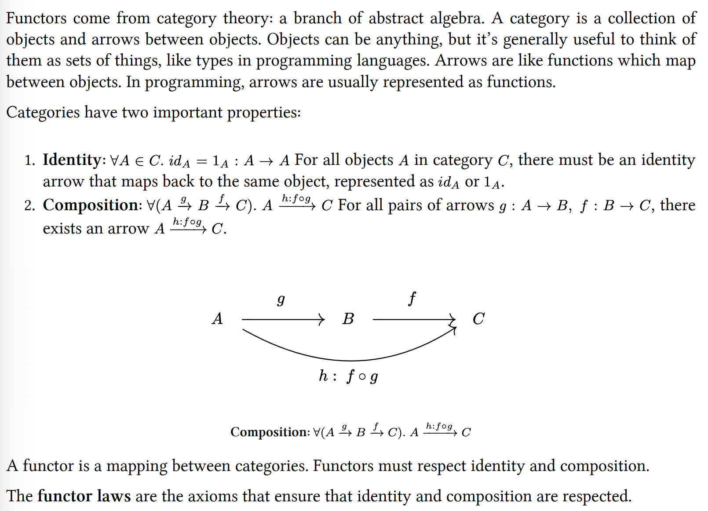
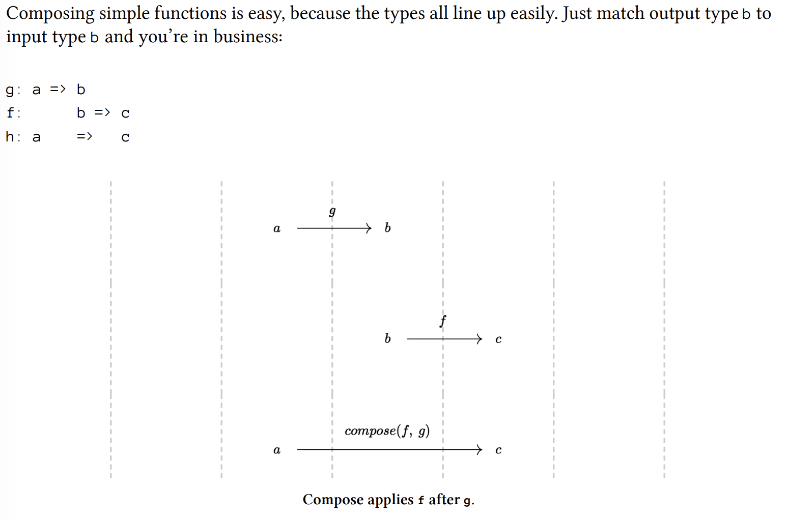
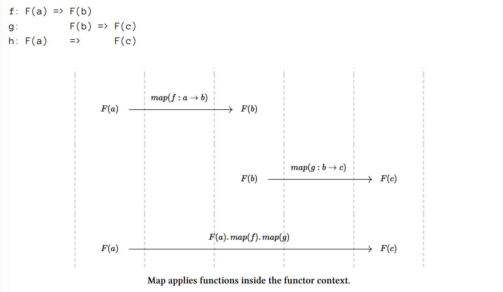
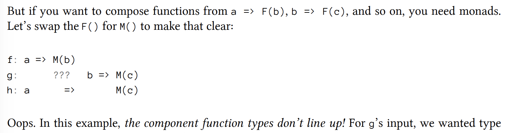
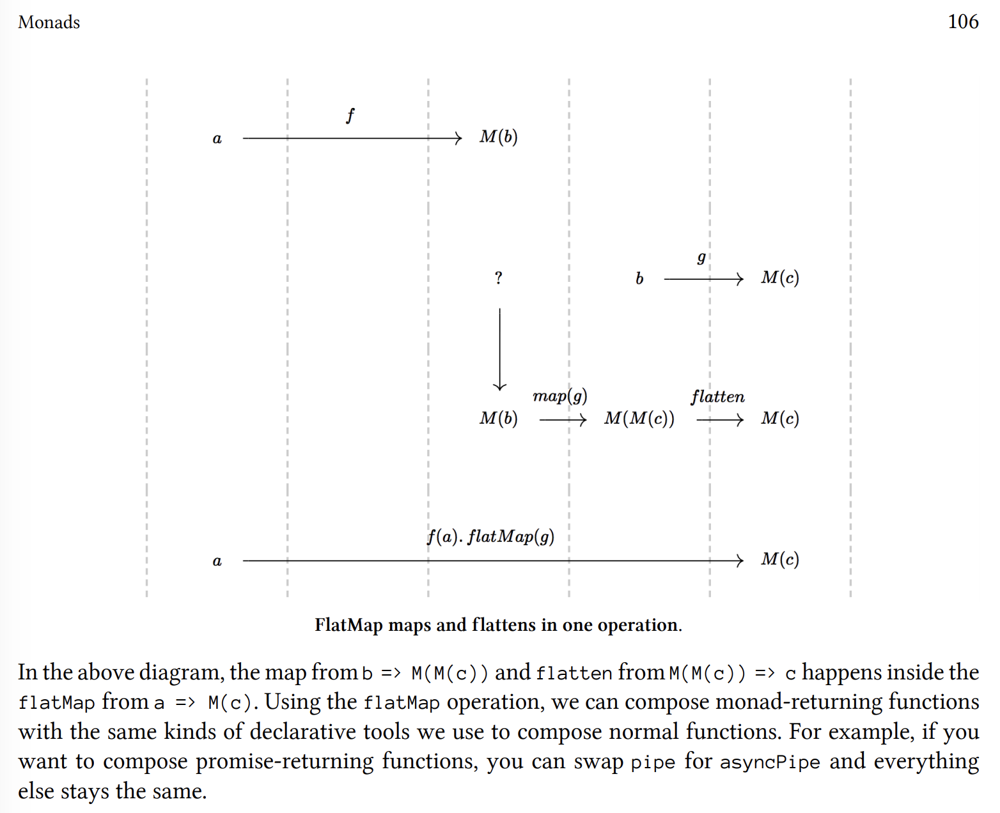

# Functors & Categories

When you see a functor datatype, you
should think “mappable”. In JavaScript, functor types are typically represented as an object with a
.map() method that maps from inputs to outputs.

In category theory, a functor is a structure preserving map from category to category, where
“structure preserving” means that the relationships between objects and morphisms are retained.

The JavaScript array .map() method is a good example of a functor, but many other kinds of objects
can be mapped over as well, including promises, streams, trees, objects, etc.

The point of a functor is to apply a given function to
values contained within the context of the structure.

In Haskell, the functor map operation is called fmap and has the signature:

```haskell
fmap :: (a -> b) -> f a -> f b
```

Given a function that takes an a and returns a b and a box with zero or more as inside it: fmap returns
a box with zero or more bs inside it. The f a and f b bits can be read as “a functor of a” and “a
functor of b”, meaning f a has as inside the box, and f b has bs inside the box.


In Javscript,

```javascript
functor.map = Functor(a) ~> (a => b) => Functor(b)
```

The squiggly arrow (∼>) represents the instance being mapped over — the value that this points to.
It’s analogous to the f a in the Haskell signature above.
You can read the signature as functor.map, beginning with a functor of a, take a function from a to
b, and return a functor of b.

Using a functor is easy — just call .map():
```javascript
const a = [1, 2, 3];
const b = a.map(x => x * 2);

console.log(
 b // [2, 4, 6]
);
```

## Functor Laws



Identity
```javascript
1 const a = [20];
2 const b = a.map(a => a);
3
4 console.log(
5 a.toString() === b.toString() // true
6 );
```

Composition
```javascript
1 const g = n => n + 1;
2 const f = n => n * 2;
3 const mappable = [20];
4
5 const a = mappable.map(g).map(f);
6 const b = mappable.map(x => f(g(x)));
7
8 console.log(
9 a.toString() === b.toString() // true
10 );
```

## Build Your Own Functor


Here’s a simple example of a functor:
```javascript
const Identity = value => ({
map: fn => Identity(fn(value))
});
```

Identity takes a value and returns an object with a .map() method. The .map() method takes
a function and returns the result of applying the function to the value inside the Identity. The
returned value is wrapped inside another Identity. Functor maps always return an instance of the
same functor type.


As you can see, Identity satisfies the functor laws:
```javascript
const Identity = value => ({
map: fn => Identity(fn(value))
});

// trace() is a utility to let you easily inspect
// the contents.
const trace = x => {
console.log(x);
return x;
};

const u = Identity(2);
// Identity law
const r1 = u; // Identity(2)
const r2 = u.map(x => x); // Identity(2)

r1.map(trace); // 2
r2.map(trace); // 2

const f = n => n + 1;
const g = n => n * 2;

// Composition law
const r3 = u.map(x => f(g(x))); // Identity(5)
const r4 = u.map(g).map(f); // Identity(5)

r3.map(trace); // 5
r4.map(trace); // 5
```

Now you can map over any data type, just like you can map over an array. You can add the map
method to any custom data type.

## Curried Map

What if you want a generic map that works with any functor? You could partially apply arguments
to create new mapping functions that work with any mappable type!

```javascript
// import curry from 'lodash/fp/curry';
// OR use this magic spell:
const curry = (
f, arr = []
) => (...args) => (
a => a.length === f.length ?
f(...a) :
curry(f, a)
)([...arr, ...args]);

const Identity = value => ({
map: fn => Identity(fn(value))
});

const map = curry((fn, mappable) => mappable.map(fn));
const log = x => console.log(x);

const double = n => n * 2;
const mdouble = map(double);

mdouble(Identity(4)).map(log); // 8
mdouble([4]).map(log); // 8
```

# Monads

Example of a functor context in JavaScript:

```javascript
const x = 20; // Some data of type `a`
const f = n => n * 2; // A function from `a` to `b`


const arr = Array.of(x); // The type lift. Type lift means to lift a type into a context, wrapping values inside a data type that supplies
the computational context a => M(a).
// JS has type lift sugar for arrays: [x]

// .map() applies the function f to the value x
// in the context of the array.
const result = arr.map(f); // [40]


const echo = n => x => Array.from({ length: n }).fill(x);

console.log(
[1, 2, 3].map( echo(3) )
// [[1, 1, 1], [2, 2, 2], [3, 3, 3]]
);


// FlatMap is the operation that defines a monad. It combines map and flatten into a single
operation used to compose type lifting functions (a => M(b)).
console.log(
[1, 2, 3].flatMap(echo(3))
// => [1, 1, 1, 2, 2, 2, 3, 3, 3]
);
```



Composing with functors is also easy if you’re mapping F(a) => F(b) because the types line up






Here is an example when Monad is needed.

```javascript
const compose = (...fns) => x => fns.reduceRight((y, f) => f(y), x);

const trace = label => value => {
console.log(`${ label }: ${ value }`);
return value;
};


const label = 'API call composition';

// a => Promise(b)
const getUserById = id => id === 3 ?
Promise.resolve({ name: 'Kurt', role: 'Author' }) :
undefined;

// b => Promise(c)
const hasPermission = ({ role }) => (
Promise.resolve(role === 'Author')
);

// Try to compose them. Warning: this will fail.
const authUser = compose(hasPermission, getUserById);

// Oops! Always false!
authUser(3).then(trace(label));
```

When we try to compose hasPermission() with getUserById() to form authUser() we run into
a big problem because hasPermission() is expecting a User object and getting a Promise(User)
instead.

```javascript
const compose = (...fns) => x => fns.reduceRight((y, f) => f(y), x);

const trace = label => value => {
console.log(`${ label }: ${ value }`);
return value;
};

// Hidden in that weird reducer is the algebraic definition of function composition: f(g(x)).
// const compose = (f, g) => x => f(g(x));
const composeM = flatMap => (...ms) => (
ms.reduce((f, g) => x => g(x)[flatMap](f))
);

const composePromises = composeM('then');

const label = 'API call composition';

// a => Promise(b)
const getUserById = id => id === 3 ?
Promise.resolve({ name: 'Kurt', role: 'Author' }) :
undefined;

// b => Promise(c)
const hasPermission = ({ role }) => (
Promise.resolve(role === 'Author')
);

// Compose the functions (this works!)
const authUser = composePromises(hasPermission, getUserById);

authUser(3).then(trace(label)); // true
```

to understand composeM, let's understand composeMap -> composePromise -> composeM
```javascript
const composeMap = (...ms) => (
ms.reduce((f, g) => x => g(x).map(f))
);

// e.g. ms = [f1, f2, f3]
f == x => f2(x).map(f1)
g == f3

x => f3(x).map(z => f2(z).map(f1))
i.e. x => f1(f2(f3(x)))
```

by the same token, composePromises() by replacing map with then
```javascript
const composePromises = (...ms) => (
ms.reduce((f, g) => x => g(x).then(f))
);


const trace = label => value => {
console.log(`${ label }: ${ value }`);
return value;
};

const label = 'Promise composition';

const g = n => Promise.resolve(n + 1);
const f = n => Promise.resolve(n * 2);

const h = composePromises(f, g);

h(20).then(trace(label));
```

A step further, using a higher-order functino to handle both
```javascript
const composeM = method => (...ms) => (
ms.reduce((f, g) => x => g(x)[method](f))
);
// Now we can write the specialized implementations like this:
const composePromises = composeM('then');
const composeMap = composeM('map');
const composeFlatMap = composeM('flatMap');
```

## Conclusions
Monads are a way to compose type lifting functions: g: a => M(b), f: b => M(c). To accomplish
this, monads must flatten M(b) to b before applying f(). In other words, functors are things you can
map over. Monads are things you can flatMap over:


